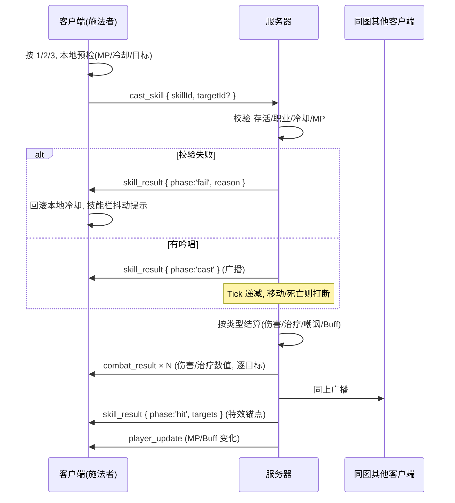

# M8 职业技能与装备 — 完成说明

> 对应需求文档《MMORPG网页游戏需求文档.md》第二期 M8 里程碑。
> 本里程碑新增:每职业 3 个技能(1/2/3 快捷键)、Buff/Debuff 框架、装备系统(武器/盔甲/盾牌)、角色面板(C 键)。

---

## 一、功能总览

### 1.1 技能(9 个,配置表 `server/data/skills.json`)

| 职业 | 键 | 技能 | 类型 | 效果 | MP | 冷却 | 吟唱 |
|------|----|------|------|------|----|------|------|
| 勇者 | 1 | 重斩 | 单体伤害 | 220% 攻击力 | 8 | 6s | — |
| 勇者 | 2 | 旋风斩 | 近身 AOE | 半径 3.5m 内 140% | 12 | 8s | — |
| 勇者 | 3 | 挑衅 | 嘲讽 | 半径 6m 怪物强制打自己 | 6 | 10s | — |
| 法师 | 1 | 火球术 | 单体伤害 | 260% 攻击力, 射程 10m | 10 | 4s | 0.5s |
| 法师 | 2 | 闪电链 | 直线 AOE | 前方 12×2m 内 180% | 18 | 8s | 0.8s |
| 法师 | 3 | 冰冻术 | 伤害+减速 | 120% + 减速 50%/4s | 12 | 10s | — |
| 僧侣 | 1 | 治疗术 | 单体治疗 | 回 300% 攻击力, 自动选范围内血量比例最低者 | 12 | 3s | 0.5s |
| 僧侣 | 2 | 群体治疗 | AOE 治疗 | 半径 8m 全体回 200% | 25 | 12s | 1.0s |
| 僧侣 | 3 | 强化术 | Buff | 半径 8m 全体攻击 +25%/20s | 20 | 25s | — |

要点:
- 校验(MP/冷却/距离/目标)与结算全部在服务器(`server/systems/skills.js`);
- 吟唱技能移动会被打断(不扣 MP 不进冷却);
- 挑衅利用现有仇恨规则:嘲讽后其他玩家攻击不会抢走仇恨,天然持续到怪物脱战;
- 配合技能消耗,新增 **MP 自然回复**:每秒回 `1 + 2% maxMp`(死亡时不回复)。

### 1.2 装备(14 件,配置表 `server/data/items.json`)

- 三个槽位:武器 / 盔甲 / 盾牌,穿戴直接加 atk/def;
- **初始装备**:建号即穿上职业三件套(勇者:铜之剑+皮甲+木盾;法师:橡木杖+布衣+木盾;僧侣:木质锤+布衣+木盾);老角色登录自动补发;
- **获取方式(本期)**:击杀怪物按概率(5%~10%)直接掉入背包,聊天面板系统消息提示;地面掉落拾取在 M10、商店在 M9 再做;
- 只掉本职业可用的装备;背包上限 30,满时提示丢失;
- 掉落对照:史莱姆→布衣、大嘴鸟→皮甲/青铜盾、毒蛾→锁子甲、树精→圣者之锤、骷髅→钢铁剑/精灵法珠、石魔像→烈焰法杖/骑士铠甲、恶魔→巨人塔盾。

### 1.3 Buff/Debuff 框架

- 玩家 Buff(`player.buffs`)与怪物 Debuff(`monster.debuffs`)均由服务器 Tick 计时递减;
- 强化术(blessing)修改 `playerStats()` 全局属性口径 → 普攻/技能伤害同步变化;
- 冰冻(slow)以移速乘子作用于怪物 AI 的巡逻/追击/回归;
- 客户端表现:HUD Buff 图标(带剩余秒)、脚下金色光环(自己+远程玩家)、怪物冰蓝染色。

### 1.4 UI 与表现

- **技能栏**(屏幕下方):图标+快捷键+冷却遮罩+倒计时,MP 不足灰显,失败原因抖动提示,吟唱进度条;
- **角色面板**(C 键):属性总览(攻防显示装备加成拆分)、装备三栏(点击卸下)、背包列表(点击穿戴,职业不符灰显);
- **技能特效**(基础几何体,零新依赖):火球飞行+爆开、闪电条带、旋风/挑衅/AOE 扩散环、冰晶、治疗/强化光柱、治疗绿色飘字。

---

## 二、施法流程



---

## 三、新增/修改文件

### 服务器
| 文件 | 说明 |
|------|------|
| `server/data/skills.json` | 新建, 9 技能配置 |
| `server/data/items.json` | 新建, 14 装备配置(含 starter/drop 字段) |
| `server/systems/skills.js` | 新建, 施法校验/吟唱/按类型结算 |
| `server/systems/items.js` | 新建, 装备表/初始装备/掉落表/属性加成 |
| `server/systems/monsters.js` | 怪物 debuffs 结构 + 减速乘子 + slowed 公开字段 |
| `server/world/world.js` | playerStats 叠装备与 Buff、CAST_SKILL/EQUIP/UNEQUIP handler、Tick 加 Buff/吟唱/MP 回复、掉落挂 grantReward、存档扩展 |
| `server/auth/accounts.js` | 建号发放初始装备 |
| `server/store/jsonStore.js` | Windows 下 rename EPERM 重试+降级(修复既有偶发崩溃) |
| `shared/events.js` | 新增 CAST_SKILL/EQUIP_ITEM/UNEQUIP_ITEM/SKILL_RESULT/INVENTORY_UPDATE |

### 前端
| 文件 | 说明 |
|------|------|
| `src/game/gameData.js` | 新建, 直接 import 服务器配置表(一份数据两端共用) |
| `src/ui/SkillBar.jsx` | 新建, 技能栏 |
| `src/ui/CharacterPanel.jsx` | 新建, 角色面板 |
| `src/game/entities/SkillEffects.jsx` | 新建, 技能特效 |
| `src/game/entities/BuffRing.jsx` | 新建, 强化光环 |
| `src/game/entities/Player.jsx` | 1/2/3 施法链路 + 技能动画 |
| `src/game/net/socket.js` / `worldStore.js` | 新事件收发、本地乐观冷却、库存状态 |
| `src/game/entities/Monster.jsx` | 冰冻染蓝 |
| `src/game/entities/RemotePlayer.jsx` | 远程玩家光环 |
| `src/game/entities/DamagePopups.jsx` | 治疗绿色飘字 |
| `src/ui/GameScreen.jsx` | 挂载新组件、C 键、Buff 图标、掉落系统消息 |
| `src/App.css` | 技能栏/角色面板/Buff 图标样式 |

### 测试
- `test-server/test-skills.js`:39 项断言全通过(初始装备、换装属性、火球全流程、冷却/MP 拒绝、冰冻减速、吟唱打断、挑衅、旋风斩、闪电、治疗选目标、强化术生效与到期、掉落、存档);
- `test-server/test-combat.js`:适配 M7 出生点(王城)后回归通过(14/14);
- `test-server/test-sync.js`(8/8)、`test-map.js`(22/22)回归通过。

## 四、运行与验证

```bash
npm run dev:all          # 一并启动前后端
node test-server/test-skills.js   # 需先启动服务器
```

手动验收建议:双浏览器分别登勇者+法师(或僧侣),在起始平原:
1. 按 1/2/3 释放技能,观察冷却遮罩、MP 扣减、特效与飘字;
2. 吟唱中移动 → 施法被打断;
3. 法师拉怪后勇者按 3 挑衅 → 怪转头打勇者;冰冻后怪明显变慢且染蓝;
4. 按 C 打开角色面板,卸下/穿上武器 → 攻击面板值与实际伤害同步变化;
5. 刷史莱姆等掉落(布衣 10%),聊天出现系统提示,面板可穿戴;
6. 重新登录 → 装备与背包不丢。
