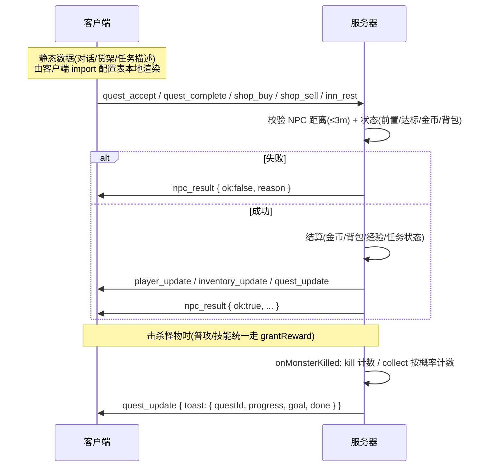

# M9 NPC、商店与任务系统 — 完成说明

> 对应需求文档《MMORPG网页游戏需求文档.md》第二期 M9 里程碑。
> 本里程碑新增:王城 5 个 NPC(头顶名字+任务标记)、DQ 风格对话框、商店买卖、旅馆恢复、主线任务链 9 环、任务面板(Q 键)。

---

## 一、功能总览

### 1.1 NPC(配置表 `server/data/npcs.json`)

| NPC | 位置(王城) | 功能 |
|------|------|------|
| 阿雷夫国王 | 城堡门前 (0, -12.5) | 主线任务发布/交付,头顶 !/? 任务标记 |
| 武器店老板 巴克 | 左上房屋前 (-15, -4) | 出售武器+盾牌,回收装备 |
| 防具店老板娘 莉娜 | 右上房屋前 (15, -4) | 出售盔甲,回收装备 |
| 旅馆老板 汤姆 | 左下房屋前 (-18, 10.5) | 付费回满 HP/MP(等级×5 G) |
| 修女 艾玛 | 右下房屋前 (18, 10.5) | 对话(复活机制提示,功能留后续) |

- NPC 为几何体小人(按 shape 差异化:王冠/头巾/宽体等),头顶 Billboard 名字;
- **任务标记**:可交付=金色 `?`(最优先)> 可接取=金色 `!` > 进行中=灰色 `?`,上下浮动动画,纯客户端按任务状态计算;
- **E 键交互**:靠近 NPC(2.5m)显示"按 E 与 XX 对话",NPC 优先于传送门;走出范围或按 Esc 自动关闭对话框。

### 1.2 商店(只卖装备,消耗品留 M10)

- 商品来自 `items.json` 全部 14 件装备(新增 `price` 字段,定价公式 `15×(atk+def)^1.5` 取整到 5);
- 购买:服务器校验 货架槽位/金币/背包容量(30 格);职业不符的装备灰显提示但仍可购买(与穿戴规则一致);
- 出售:两店均半价回收(`floor(price/2)`),按背包下标出售(同名装备安全);
- 价格区间:布衣/木盾 40G → 烈焰法杖/骑士铠甲 785G。

### 1.3 旅馆

- 费用 `等级 × 5 G`(约等于 2~3 只当前等级怪的金币产出),付费后 HP/MP 回满;金币不足拒绝并提示。

### 1.4 任务系统(配置表 `server/data/quests.json`)

两种模板:
- **kill 击杀类**:击杀目标怪物直接计数;
- **collect 收集类**:击杀目标怪物按概率获得素材计数(**素材不占背包**,纯任务进度,用户已确认方案)。

**主线 9 环**(全部由国王发布,严格链式 prereq):

| # | 任务 | 类型 | 目标 | 奖励 | 达成约 |
|---|------|------|------|------|--------|
| 1 | 史莱姆讨伐 | kill | 史莱姆×6 | 40exp/60G | Lv.3 |
| 2 | 凝胶采集 | collect | 凝胶×6(70%) | 60/80 + 皮甲 | Lv.4 |
| 3 | 大嘴鸟的骚扰 | kill | 大嘴鸟×8 | 100/120 + 青铜盾 | Lv.5 |
| 4 | 迷雾中的毒粉 | collect | 鳞粉×6(60%) | 150/150 + 锁子甲 | Lv.6-7 |
| 5 | 暴走的树精 | kill | 树精×5 | 200/200 | Lv.7-8 |
| 6 | 洞窟的亡灵 | kill | 骷髅兵×8 | 280/250 + 职业武器(钢剑/烈焰杖/圣锤) | Lv.9 |
| 7 | 魔像核心 | collect | 核心×4(50%) | 400/350 + 职业盾(塔盾/法珠) | Lv.10-11 |
| 8 | 城门死斗 | kill | 恶魔卫兵×3 | 550/500 + 骑士铠甲(法师折 200G) | Lv.11-12 |
| 9 | 恶魔的徽记 | collect | 徽记×2(60%) | 800/800,完成语衔接 M12 | Lv.13 |

- 等级节奏按 `expToNext=20·L^1.6` 与怪物经验推算,Q6/Q7 的装备奖励在挑战魔像/恶魔前形成战力质变;
- Q8/Q9 在魔王城入口区完成,即达成验收要求"引导到魔王城门口";
- 进度实时推送(击杀即弹聊天系统消息 `【任务】史莱姆讨伐 3/6`,达标提示回城交付);
- 任务状态存档于 `character.quests {active, completed}`,重连/重启不丢。

### 1.5 UI

- **NPC 对话框**(dq-panel 风格,屏幕下方):打字机逐字对话(点击跳过)+ 按 NPC 类型的功能区——任务列表(接受/交付按钮)、商店两 Tab(购买/出售)、旅馆休息按钮;
- **任务面板**(Q 键,右侧):主线进度 n/9、进行中任务(目标/进度条/可交付金色高亮)、已完成折叠列表;
- 所有交互结果(买卖/休息/接交任务)走聊天面板系统消息。

---

## 二、交互协议



设计要点:
- **无 NPC_INTERACT 往返**:延续 M8 "配置表两端共用"模式,只有 5 个有副作用的事件走 Socket,全部服务器权威校验;
- `grantReward` 拆出 `gainExpGold(p, exp, gold)`:升级循环只有一份,击杀奖励与任务奖励共用;
- 任务进度走专用 `QUEST_UPDATE` 事件,不膨胀高频的 player_update。

---

## 三、新增/修改文件

### 配置与共享
| 文件 | 说明 |
|------|------|
| `server/data/npcs.json` | 新建,5 个 NPC(位置/朝向/类型/对话/外形) |
| `server/data/quests.json` | 新建,主线 9 环(目标/概率/对话/奖励含职业分支) |
| `server/data/items.json` | 14 件装备增加 price 字段 |
| `shared/events.js` | 新增 QUEST_ACCEPT/QUEST_COMPLETE/SHOP_BUY/SHOP_SELL/INN_REST/QUEST_UPDATE/NPC_RESULT |
| `shared/config.js` | 新增 NPC_RANGE=2.5 |

### 服务器
| 文件 | 说明 |
|------|------|
| `server/systems/npcs.js` | 新建,NPC 距离校验/商店买卖/旅馆结算 |
| `server/systems/quests.js` | 新建,任务接交/击杀钩子/进度推送/老角色兼容 |
| `server/world/world.js` | grantReward 拆 gainExpGold + 挂 onMonsterKilled、5 个事件接线、存档加 quests、连接时 ensureQuests+pushQuests |
| `server/auth/accounts.js` | 建号初始化 quests 空结构 |

### 前端
| 文件 | 说明 |
|------|------|
| `src/game/gameData.js` | 导出 NPCS/QUESTS/QUESTS_BY_NPC/QUEST_TOTAL |
| `src/game/net/worldStore.js` | quests 状态 + subscribeQuests(toast 转发) |
| `src/game/net/socket.js` | 新事件监听 + 5 个发送函数 + WELCOME 初始化任务 |
| `src/game/entities/Npc.jsx` | 新建,几何体小人 + 名字 + !/? 标记 |
| `src/game/scenes/GameMap.jsx` | 渲染本图 NPC |
| `src/game/entities/Player.jsx` | nearNpc 检测 + E 键 NPC 优先 |
| `src/ui/NpcDialog.jsx` | 新建,打字机对话框 + 任务/商店/旅馆视图 |
| `src/ui/QuestPanel.jsx` | 新建,Q 键任务日志 |
| `src/ui/GameScreen.jsx` | activeNpc/Q 键/交互提示/系统消息接线 |
| `src/App.css` | npc-dialog/shop/quest-panel 等样式 |

### 测试
- `test-server/test-npc-quest.js`:**34/34 通过**(任务空结构/距离校验/跳链拒绝/击杀 toast/交付奖励/收集类概率计数且素材不占背包/商店买卖金额/旅馆回满/金币不足/重连恢复);
- 回归:`test-combat.js` 14/14、`test-skills.js` 39/39(gainExpGold 重构验证)。

## 四、运行与验证

```bash
npm run dev:all                      # 一并启动前后端
node test-server/test-npc-quest.js   # 需先启动服务器
```

手动验收路线(新角色):
1. 出生王城,国王头顶金色 `!`,走近按 E → 对话 → 接受「史莱姆讨伐」;
2. 北门传送到平原杀史莱姆,聊天出现进度 toast,Q 面板显示 3/6 与进度条;
3. 杀满 6 只 → 提示可交付 → 回城国王头顶金色 `?` → 交付得 40exp/60G;
4. 武器店买青铜盾(170G)、半价卖回(85G);被怪打残后旅馆休息回满(Lv×5 G);
5. 顺主线推进,Q6/Q7 拿职业武器/盾,Q8/Q9 打到魔王城门口,主线 9/9;
6. 重新登录,任务进度与已完成记录不丢。
