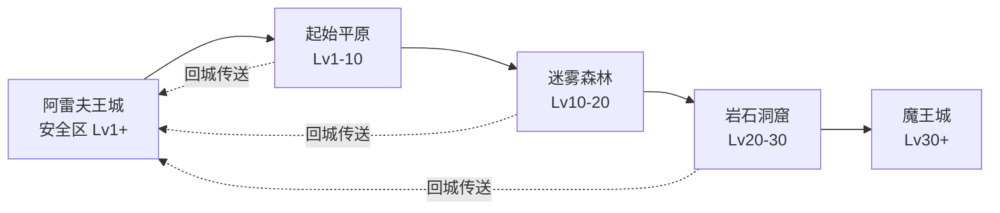
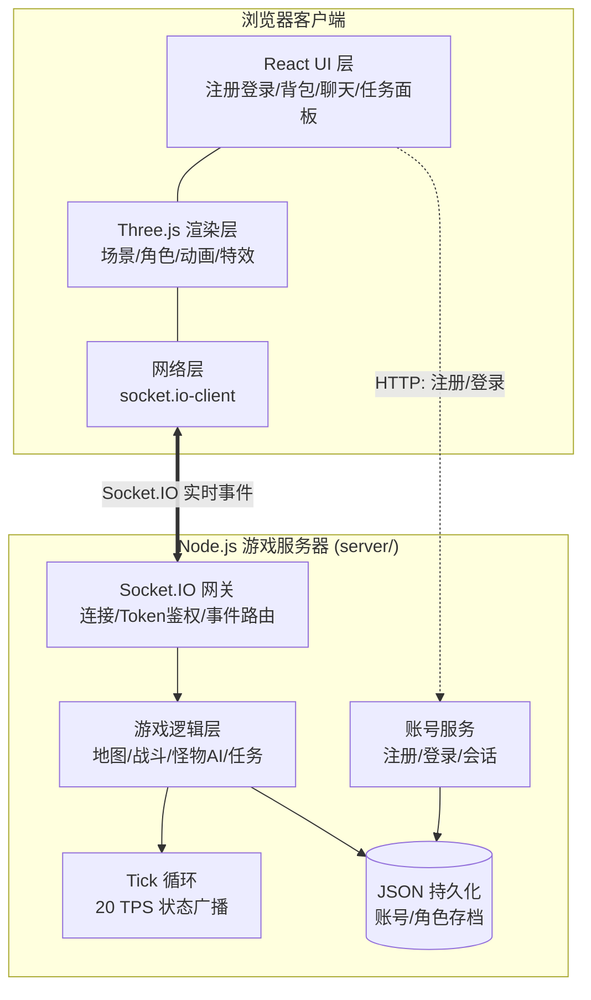
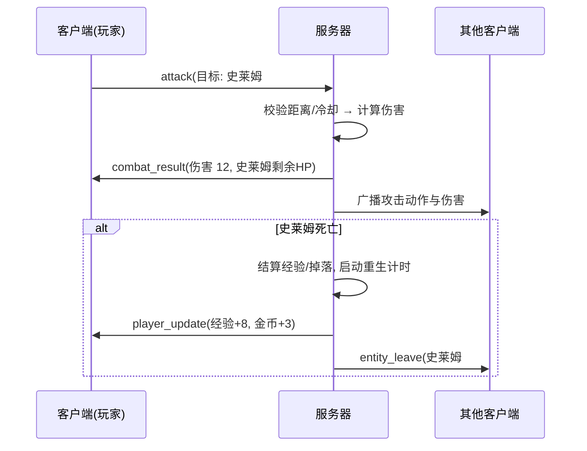

# 3D 网页版多人 MMORPG 需求文档

> 世界观参考《勇者斗恶龙》（Dragon Quest）风格的经典 JRPG 设定。
> 前端基于本项目（Vite + React 19），服务器使用 Node.js（JS）编写，两者位于同一仓库，可一并启动运行。

---

## 一、项目概述

### 1.1 目标

开发一款运行在浏览器中的 3D 多人在线角色扮演游戏（MMORPG）：

- 玩家通过浏览器进入游戏，创建角色，在同一个世界中冒险；
- 多个玩家可以在同一张地图上互相看见、聊天、组队打怪；
- 世界结构参考《勇者斗恶龙》：**王城 → 城镇 → 野外平原 → 洞窟/地下城 → 魔王城** 的经典布局；
- 美术走低多边形（Low Poly）+ 明快色彩的卡通风格，贴近 DQ 的轻松氛围。

### 1.2 技术定位

| 部分 | 技术选型 | 说明 |
|------|----------|------|
| 前端框架 | Vite + React 19（现有项目） | 沿用当前工程 |
| 3D 渲染 | Three.js + @react-three/fiber + @react-three/drei | React 生态下最成熟的 3D 方案 |
| 3D 模型资源 | Quaternius / Kenney 免费低模素材（GLB 格式） | CC0 授权，可商用 |
| 网络通信 | **Socket.IO**（客户端 `socket.io-client`，服务端 `socket.io`） | 实时双向通信，自带断线重连、房间（Room）、事件机制 |
| 游戏服务器 | Node.js（纯 JS，ESM） | 放在本仓库 `server/` 目录 |
| 账号系统 | 简单注册/登录（用户名 + 密码，bcrypt 加密存储） | 第一版即包含 |
| 数据持久化 | JSON 文件（账号、角色存档） | 已确认，后续可平滑迁移 SQLite |
| 一并运行 | `concurrently` 同时启动 client + server | `npm run dev:all` |

---

## 二、世界观与世界划定（参考勇者斗恶龙）

### 2.1 背景故事（草案）

> 大魔王苏醒，世界被黑暗侵蚀。国王向全国发出召集令，无数勇者（玩家）响应号召，从阿雷夫王城出发，踏上讨伐魔王之路。

### 2.2 世界区域划分

参考 DQ 的世界结构，第一版规划 **5 张地图**，按等级递进：

| 区域 | 类型 | 建议等级 | 主要内容 |
|------|------|----------|----------|
| 阿雷夫王城（Aleph Castle） | 主城/安全区 | 1+ | 出生点、NPC（国王/商店/旅馆/教会）、任务发布、玩家社交集散地 |
| 起始平原（Novice Plain） | 野外 | 1-10 | 史莱姆、大嘴鸟等低级怪，新手任务 |
| 迷雾森林（Mist Forest） | 野外 | 10-20 | 毒蛾、树精，中级素材采集 |
| 岩石洞窟（Rock Cavern） | 地下城 | 20-30 | 骷髅兵、石魔像，洞窟 BOSS（守关魔将） |
| 魔王城（Demon Castle） | 终局地下城 | 30+ | 高级怪 + 最终 BOSS 大魔王（建议组队挑战） |

### 2.3 世界地图关系图



- 地图之间通过**传送点/出入口**切换（DQ 式的走到边缘切图）；
- 王城为安全区，不会发生战斗；
- 每张野外地图有固定的怪物刷新点（Spawn Point），怪物被击杀后按刷新时间重生。

---

## 三、核心玩法需求

### 3.1 账号与角色系统

- **注册/登录（简单账号系统）**：
  - 注册：用户名（唯一）+ 密码，密码用 bcrypt 哈希后存入 JSON；
  - 登录：校验后由服务器签发会话 Token（内存会话即可），Socket.IO 连接时携带 Token 鉴权；
  - 同一账号同时只允许一个连接在线（顶号：后登录的踢掉先登录的）；
- **创建角色**：登录后输入昵称、选择职业（第一版一个账号一个角色）；
- **职业（第一版 3 种，参考 DQ 转职系统简化）**：
  | 职业 | 定位 | 特点 |
  |------|------|------|
  | 勇者（战士型） | 近战/坦克 | 高血量高防御，剑技 |
  | 魔法师 | 远程输出 | 火球/闪电等攻击魔法，脆皮 |
  | 僧侣 | 治疗辅助 | 治疗术（霍伊米）、增益 |
- **属性**：HP / MP / 攻击 / 防御 / 敏捷 / 等级 / 经验值；
- **升级**：击杀怪物获得经验，升级提升属性并回满 HP/MP；
- **死亡惩罚**：DQ 式——死亡后回王城教会复活，金币减半（第一版可先做「回城复活」）。

### 3.2 战斗系统

- **实时战斗**（已确认，非回合制）：
  - 普通攻击：靠近目标点击攻击；
  - 技能：每个职业 2~3 个技能，有 MP 消耗与冷却时间；
  - 战斗结算（伤害计算、掉落）**必须在服务器端进行**，客户端只做表现；
- **怪物 AI**（服务器端）：
  - 待机 → 巡逻 → 发现玩家（进入索敌范围）→ 追击 → 攻击 → 脱战回归；
- **掉落**：金币 + 概率掉落物品（药草、装备）。

### 3.3 多人交互

- **同屏可见**：同一地图内的玩家互相可见，实时同步位置、朝向、动作（移动/攻击/施法/死亡）；
- **聊天**：
  - 世界频道（全服）；
  - 当前地图频道；
  - （二期）私聊、队伍频道；
- **组队**（二期）：邀请组队、经验共享、队伍血条显示；
- **玩家名字与血条**：头顶显示昵称、等级、血条。

### 3.4 NPC 与任务系统

- **NPC 类型**：
  | NPC | 功能 |
  |------|------|
  | 国王 | 主线任务发布（讨伐魔王线） |
  | 武器店/道具店老板 | 购买/出售装备与消耗品 |
  | 旅馆老板 | 付费回满 HP/MP（DQ 经典） |
  | 教会修女 | 复活点登记、存档提示 |
- **任务类型（第一版）**：
  - 击杀类：如「消灭 10 只史莱姆」；
  - 收集类：如「收集 5 个药草」；
  - 主线链：从国王处领取，逐图推进直至讨伐魔王。

### 3.5 物品与背包

- **背包**：格子制（第一版 24 格），物品可堆叠；
- **物品类型**：
  - 消耗品：药草（回 HP）、魔法圣水（回 MP）、奇美拉之翼（回城道具，DQ 经典）；
  - 装备：武器 / 盔甲 / 盾牌（影响攻防属性）；
  - 任务物品；
- **金币**：通用货币，用于商店买卖与旅馆住宿。

### 3.6 操作方式

- **移动**：WASD / 方向键，或点击地面寻路（二选一，第一版做 WASD）；
- **镜头**：第三人称跟随镜头，鼠标右键拖动旋转，滚轮缩放；
- **交互**：靠近 NPC / 传送点按 `E` 或点击交互；
- **攻击/技能**：`空格` 普攻，`1/2/3` 释放技能；
- **UI 快捷键**：`B` 背包、`Q` 任务面板、`Enter` 聊天输入。

---

## 四、系统架构需求

### 4.1 总体架构



### 4.2 服务器职责（权威服务器模型）

服务器是**唯一权威**，客户端只负责输入与表现：

1. **连接管理**：Socket.IO 连接携带 Token 鉴权、断线处理（下线后角色从世界移除并存档）、自动重连恢复；
2. **状态同步**：以固定 Tick（建议 20 次/秒）向同地图玩家广播实体状态（位置、HP、动作），利用 Socket.IO 的 Room 按地图分组广播；
3. **移动校验**：客户端上报移动意图，服务器校验速度/碰撞后确认（防作弊，第一版可宽松）;
4. **战斗结算**：伤害、命中、掉落、经验全部服务器计算；
5. **怪物 AI 与刷新**：服务器驱动怪物行为与重生；
6. **地图管理**：每张地图对应一个 Socket.IO Room，玩家切图即换 Room，只同步同地图内的实体（AOI 第一版按整图广播即可）；
7. **数据存档**：角色属性、背包、任务进度定时 + 下线时落盘。

### 4.3 通信协议（Socket.IO 事件，示例）

账号注册/登录走 **HTTP 接口**（`POST /api/register`、`POST /api/login`），登录成功返回 Token；游戏内实时通信走 **Socket.IO 事件**（连接时 `auth: { token }` 鉴权）：

| 方向 | 事件名 | 内容 |
|------|----------|------|
| C→S | `move` | 移动方向/目标坐标 |
| C→S | `attack` / `cast_skill` | 目标 ID、技能 ID |
| C→S | `chat` | 频道、内容 |
| C→S | `npc_interact` / `use_item` / `change_map` | 交互类 |
| S→C | `world_snapshot` | 本图实体状态（Tick 广播，按 Room 分发） |
| S→C | `entity_enter` / `entity_leave` | 实体进出视野 |
| S→C | `combat_result` | 伤害数字、死亡、掉落 |
| S→C | `chat_broadcast` | 聊天消息 |
| S→C | `player_update` | 自身属性/背包/任务变更 |
| S→C | `kicked` | 顶号/被踢下线通知 |

### 4.4 一次战斗的流程示例



---

## 五、目录结构规划

```
vite-fable-5/
├── src/                    # 前端（现有 Vite + React）
│   ├── game/               # 游戏核心
│   │   ├── scenes/         # 各地图场景（王城/平原/森林/洞窟/魔王城）
│   │   ├── entities/       # 玩家/怪物/NPC 的 3D 实体组件
│   │   ├── net/            # socket.io-client 封装 + HTTP 接口
│   │   └── input/          # 键鼠输入控制
│   ├── ui/                 # 注册登录/HUD/背包/聊天/任务等 React UI
│   └── main.jsx
├── public/
│   └── models/             # Quaternius/Kenney GLB 模型资源
├── server/                 # JS 游戏服务器
│   ├── index.js            # 入口（HTTP + Socket.IO 服务）
│   ├── auth/               # 注册/登录/会话 Token
│   ├── world/              # 地图/房间管理
│   ├── systems/            # 战斗/AI/任务/物品系统
│   ├── data/               # 静态配置（怪物表/物品表/地图表/任务表）
│   └── store/              # JSON 存档持久化
├── shared/                 # 前后端共享（事件名常量/公式/配置）
├── notes/                  # 文档
└── test-server/            # 服务器测试代码
```

## 六、运行方式需求

- `npm run dev` —— 仅启动前端（现有行为不变）；
- `npm run server` —— 仅启动游戏服务器；
- `npm run dev:all` —— **一并启动**前端 + 服务器（使用 `concurrently`）；
- 开发环境下前端通过 `http://localhost:3001` 连接服务器（HTTP 接口 + Socket.IO 同端口，端口可配置）。

---

## 七、分期开发计划

整体分三期，每期拆分为若干**里程碑（M）**，每个里程碑都有明确的交付物与验收标准，做完即可运行验证。

```mermaid
gantt
    title 开发分期总览
    dateFormat X
    axisFormat %s

    section 第一期 MVP
    M1 工程搭建与一键启动      :m1, 0, 1
    M2 账号系统               :m2, after m1, 1
    M3 3D 场景与角色控制       :m3, after m2, 2
    M4 多人同步               :m4, after m3, 2
    M5 战斗与怪物 AI          :m5, after m4, 2
    M6 成长/死亡/聊天/存档     :m6, after m5, 1

    section 第二期 内容扩充
    M7 全地图与切图           :m7, after m6, 2
    M8 职业技能与装备         :m8, after m7, 2
    M9 NPC/商店/任务          :m9, after m8, 2
    M10 背包与掉落拾取        :m10, after m9, 1

    section 第三期 体验完善
    M11 组队系统              :m11, after m10, 2
    M12 BOSS 与终局战         :m12, after m11, 2
    M13 表现与音效            :m13, after m12, 1
    M14 稳定性与反作弊        :m14, after m13, 1
```



### 第一期（MVP，可玩最小版本）

> 目标：两名玩家可以注册登录进入同一世界，互相看见、一起打史莱姆、升级、聊天，重开浏览器后数据还在。

#### M1 工程搭建与一键启动

- [ ] 安装依赖：`three`、`@react-three/fiber`、`@react-three/drei`、`socket.io-client`（前端）；`socket.io`、`bcryptjs`、`concurrently`（服务端/工具）；
- [ ] 建立 `server/`、`shared/` 目录骨架，服务器起一个最小 HTTP + Socket.IO 服务（`/api/health` 返回 ok）；
- [ ] `shared/` 中定义事件名常量文件，前后端共同引用；
- [ ] package.json 增加 `server`、`dev:all` 脚本；Vite 配置 `/api` 与 `/socket.io` 代理到 3001 端口；
- **验收**：`npm run dev:all` 一条命令同时启动前后端，页面能请求到 `/api/health`，Socket.IO 能连通。

#### M2 账号系统

- [ ] `POST /api/register`：用户名唯一性校验、bcrypt 哈希、写入 `server/store/accounts.json`；
- [ ] `POST /api/login`：校验密码，签发内存会话 Token；
- [ ] Socket.IO 中间件鉴权：握手 `auth.token` 无效则拒绝连接；顶号踢线（`kicked` 事件）；
- [ ] 前端注册/登录页面（React UI），Token 存 sessionStorage；
- [ ] 角色创建界面：昵称 + 三职业选择（此期职业只影响外观与基础属性，技能在二期）；
- **验收**：注册→登录→创建角色→进入游戏全流程可走通；错误提示（重名/密码错误）正常；重复登录时旧连接被踢。

#### M3 3D 场景与角色控制（单机先行）

- [ ] 下载并整理 Quaternius/Kenney 模型到 `public/models/`（角色 ×3、史莱姆、树木/建筑装饰件），记录来源与授权到 `notes/`；
- [ ] 搭建起始平原场景：地面、光照、天空、环境装饰、简单边界；
- [ ] 玩家角色加载 GLB 模型，播放 Idle/Run 动画；
- [ ] WASD 移动 + 第三人称跟随镜头（右键旋转、滚轮缩放）；
- [ ] 地图边界与简单障碍碰撞（圆形碰撞体即可，不引入物理引擎）；
- **验收**：本地单机可在平原上流畅跑动，动画切换自然，帧率 ≥ 30 FPS。

#### M4 多人同步

- [ ] 服务器世界模型：Player 实体、地图 Room、20 TPS Tick 循环；
- [ ] 客户端上报移动输入（方向 + 时间戳），服务器权威计算位置后随 `world_snapshot` 广播；
- [ ] 客户端对其他玩家做**插值平滑**（缓冲 2~3 个快照），对自己做本地预测；
- [ ] `entity_enter` / `entity_leave`：上线/下线/断线时其他客户端正确增删实体；
- [ ] 玩家头顶昵称 + 等级 + 血条（Billboard 朝向镜头）；
- **验收**：开两个浏览器窗口登录不同账号，互相可见且移动平滑不跳变；一方断网后另一方视野中其消失。

#### M5 战斗与怪物 AI

- [ ] 怪物配置表（`server/data/monsters.json`）：史莱姆的 HP/攻防/经验/金币/刷新时间；
- [ ] 平原布置刷新点，服务器驱动史莱姆 AI 状态机：待机→巡逻→索敌→追击→攻击→脱战回归；
- [ ] 普攻（空格）：客户端发 `attack`，服务器校验距离/冷却→结算伤害→广播 `combat_result`；
- [ ] 客户端表现：攻击动画、受击闪红、伤害飘字、怪物死亡消失；
- [ ] 怪物死亡结算经验/金币，按刷新时间重生；怪物也会反击玩家；
- **验收**：两名玩家可围殴同一只史莱姆，双方看到的怪物血量一致；怪物会主动追击进入索敌范围的玩家；击杀后按时重生。

#### M6 成长、死亡、聊天与存档

- [ ] 升级曲线（`shared/` 公式）：经验满级升级、属性成长、升级回满 HP/MP，广播升级特效；
- [ ] 玩家死亡：倒地→3 秒后回王城出生点复活（此期王城可先用平原一角的安全区代替）；
- [ ] 世界聊天：`Enter` 唤出输入框，聊天面板显示昵称 + 内容；
- [ ] 角色存档：属性/等级/金币/位置，定时（每 60 秒）+ 下线时写入 `server/store/characters.json`；
- [ ] HUD：左上角自身头像/HP/MP/经验条，等级显示；
- **验收**：打怪升级数值正确；死亡复活流程完整；聊天互通；重启服务器或重新登录后角色数据不丢失。

### 第二期（内容扩充）

> 目标：五张地图全部开放，职业差异化成型，任务/商店/背包闭环，玩家有明确的成长目标线。

#### M7 全地图与传送切图

- [ ] 地图配置表（`server/data/maps.json`）：五张地图的尺寸、出入口坐标、刷新点、安全区标记；
- [ ] 搭建其余四张场景：王城（建筑 + NPC 位）、迷雾森林、岩石洞窟、魔王城；
- [ ] 传送点交互（`E` 键）：服务器校验→换 Room→客户端卸载旧场景加载新场景（含 Loading 过渡）；
- [ ] 各图怪物投放：大嘴鸟/毒蛾/树精/骷髅兵/石魔像等，按等级段配置数值；
- [ ] 奇美拉之翼（回城道具）与教会复活点正式落位王城；
- **验收**：可从王城一路走到魔王城；切图后只同步新图实体；不同图玩家聊天世界频道互通、彼此不可见。

#### M8 职业技能与装备

- [ ] 技能配置表（`server/data/skills.json`）：每职业 3 个技能（伤害/范围/MP 消耗/冷却/施法时间）；
  - 勇者：重斩（单体高伤）、旋风斩（近身 AOE）、挑衅（嘲讽拉怪）；
  - 魔法师：火球（单体）、闪电（直线 AOE）、冰冻（减速控制）；
  - 僧侣：治疗术（单体回血）、群体治疗、强化术（加攻 Buff）；
- [ ] 技能释放全流程：`1/2/3` 快捷键→服务器校验 MP/冷却/距离→结算→广播特效表现；
- [ ] Buff/Debuff 框架（加攻/减速，带持续时间，服务器计时）；
- [ ] 装备系统：武器/盔甲/盾牌三栏，穿戴改变攻防属性，装备配置表（`server/data/items.json`）；
- [ ] 角色面板 UI（`C` 键）：属性总览 + 装备栏；
- **验收**：三职业组队打怪体验差异明显（坦克拉怪/法师输出/僧侣奶）；换装备后面板属性与实际伤害同步变化。

#### M9 NPC、商店与任务系统

- [ ] NPC 配置与场景落位：国王、武器店、道具店、旅馆、教会修女，头顶名字与任务标记（`!`/`?`）；
- [ ] NPC 对话框 UI（DQ 风格文本框）；
- [ ] 商店：购买/出售（出售半价），金币扣减服务器结算；
- [ ] 旅馆：付费回满 HP/MP；
- [ ] 任务系统（`server/data/quests.json`）：
  - 击杀类、收集类两种模板；
  - 主线链 8~10 环：国王发布→平原剿灭史莱姆→森林取素材→洞窟讨伐魔将→最终讨伐魔王；
  - 任务进度实时推送（`player_update`），完成后回 NPC 交付领取经验/金币/装备奖励；
- [ ] 任务面板 UI（`Q` 键）：进行中/可交付状态一目了然；
- **验收**：新角色可顺着主线任务从 1 级引导到魔王城门口；商店买卖、旅馆恢复金额结算正确。

#### M10 背包与掉落拾取

- [ ] 背包数据结构（24 格、可堆叠）与服务器端增删校验；
- [ ] 怪物掉落：按掉落表概率生成地面掉落物（光柱表现），走近按 `E` 拾取，30 秒未拾取消失；
- [ ] 消耗品使用：药草/魔法圣水（快捷使用 + 背包右键），奇美拉之翼回城；
- [ ] 背包 UI（`B` 键）：拖拽整理、右键使用/装备、物品 Tooltip；
- **验收**：打怪→掉落→拾取→使用/装备/出售整条物品链路闭环；背包满时掉落拾取有正确提示。

### 第三期（体验完善）

> 目标：组队挑战 BOSS 的终局体验成型，游戏手感、稳定性与基础反作弊达到可对外试玩水平。

#### M11 组队系统

- [ ] 组队流程：邀请/申请→接受→队伍成立（上限 4 人），队长可踢人/解散，掉线自动退队；
- [ ] 队伍内经验共享（同图范围内按等级分配）、掉落轮流分配；
- [ ] 队伍 UI：左侧队友头像/HP/MP 实时同步，地图上队友标记；
- [ ] 队伍聊天频道；
- **验收**：4 人小队跨图组队状态保持；经验分配与掉落归属规则正确。

#### M12 BOSS 与终局战

- [ ] BOSS 战框架：多技能循环（普攻/AOE 踩圈/召唤小怪）、狂暴阶段（血量 30% 以下强化）；
- [ ] 岩石洞窟 BOSS「守关魔将」：单人可挑战、组队更轻松的难度定位；
- [ ] 魔王城最终 BOSS「大魔王」：明确面向 4 人小队设计，击杀后全服公告；
- [ ] BOSS 首杀奖励与击杀成就记录（存档）；
- **验收**：满级小队可完成讨伐魔王的完整主线闭环；BOSS 技能有预警表现（踩圈红圈提示），可被走位规避。

#### M13 表现与音效

- [ ] BGM 分场景（王城/野外/洞窟/BOSS 战）、战斗音效（挥砍/施法/受击/升级/拾取）；
- [ ] 打击感优化：受击顿帧、镜头微震、技能粒子特效；
- [ ] 伤害飘字优化（暴击放大变色）、任务完成/升级横幅提示；
- [ ] 小地图（右上角，显示自己/队友/NPC/传送点）；
- [ ] 设置面板：音量、画质档位（阴影/抗锯齿开关）；
- **验收**：中端设备全特效 ≥ 30 FPS，低画质档 ≥ 50 FPS；音画反馈完整。

#### M14 稳定性与基础反作弊

- [ ] 服务器移动校验收紧：速度上限、穿墙检测（超限回弹纠正）；
- [ ] 技能/攻击全部服务器冷却计时，客户端冷却仅做表现；
- [ ] 输入合法性校验：聊天长度/频率限制（防刷屏）、事件频率限流；
- [ ] JSON 存档加固：写入原子化（临时文件 + rename）、启动时损坏检测与备份恢复；
- [ ] 压测脚本（`test-server/`）：模拟 20+ 机器人客户端连接移动，观测 Tick 耗时与内存；
- [ ] 服务器日志（登录/异常/结算流水）；
- **验收**：单地图 20 人压测 Tick 稳定不掉帧；修改客户端发包无法加速/瞬移；存档在强杀进程后可恢复。

### 依赖关系说明

- M1~M6 严格串行，是后续一切的地基；
- 二期中 M7 完成后，M8/M9/M10 可并行推进；
- 三期 M11 是 M12 的前置（BOSS 面向组队设计）；M13/M14 可与 M11/M12 并行。

---

## 八、非功能性需求

| 项 | 要求 |
|----|------|
| 同图承载 | 第一版目标单地图 ≥ 20 名玩家流畅同步 |
| 同步频率 | 服务器 Tick 20 次/秒；客户端插值平滑移动 |
| 首屏加载 | 模型走低模 + 压缩纹理，进入游戏 ≤ 5 秒（本地） |
| 帧率 | 中端设备浏览器 ≥ 30 FPS |
| 兼容性 | Chrome / Edge 最新版（WebGL2） |
| 代码规范 | 前端过 oxlint；服务器纯 ESM JS |

---

## 九、已确认决策

| 问题 | 决策 |
|------|------|
| 战斗制式 | **实时制** |
| 模型资源 | **Quaternius / Kenney 免费低模素材**（CC0） |
| 账号体系 | **简单注册系统**（用户名 + 密码，bcrypt 加密） |
| 数据持久化 | **JSON 文件**（初期），后续视需要迁移 SQLite |
| 通信方案 | **Socket.IO**（自带房间、断线重连、事件机制） |
