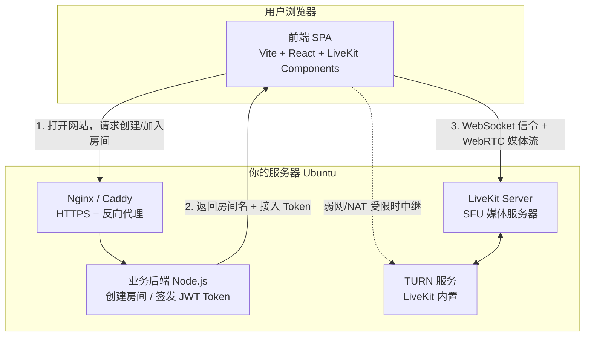
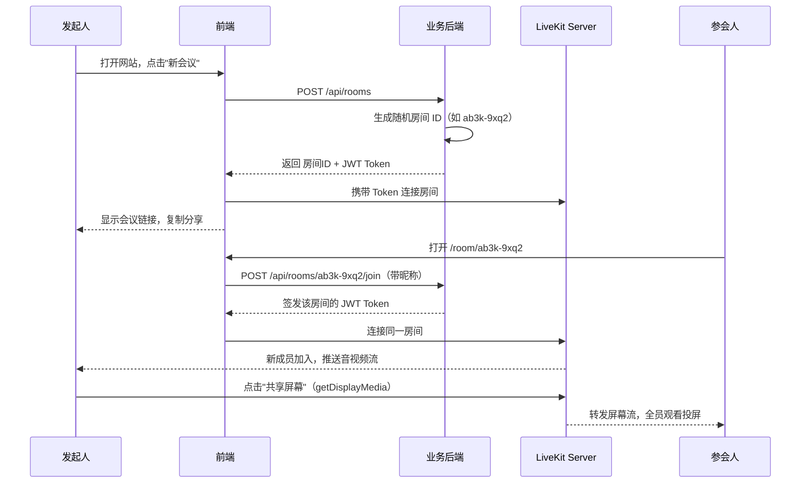

# 在线会议软件开发方案

## 一、项目目标

做一个"链接即会议"的轻量级在线会议软件：

- 打开网站自动创建会议，生成一个唯一链接（如 `https://meet.example.com/room/ab3k-9xq2`）
- 任何拿到链接的人打开即可加入，无需注册账号
- 支持多人实时音视频通话
- 支持屏幕共享（投屏演示）
- 后续可扩展：文字聊天、举手、静音管理、录制等

## 二、技术选型分析

### 2.1 为什么不自己从零写 WebRTC

WebRTC 是浏览器原生的实时音视频标准，但直接裸写有几个大坑：

| 问题 | 说明 |
|------|------|
| 信令服务器 | WebRTC 只管传输，连接建立（SDP/ICE 交换）要自己写 |
| Mesh 架构不可扩展 | P2P 全互联模式下 4 人以上就卡（每人要上传 N-1 路流） |
| SFU 开发成本极高 | 要支持多人就得写转发服务器（SFU），涉及拥塞控制、Simulcast、带宽自适应，没有半年做不好 |
| NAT 穿透 | 需要自建 STUN/TURN 服务器处理复杂网络环境 |

结论：**必须选一个现成的开源 SFU 方案**，把精力放在业务逻辑上。

### 2.2 候选方案对比

| 方案 | 开发速度 | 部署难度 | 前端组件 | 说明 |
|------|---------|---------|---------|------|
| **LiveKit（推荐）** | 极快 | Docker 一键 | 官方 React 组件库，UI 都做好了 | Go 写的开源 SFU，文档好，社区活跃，屏幕共享/多人通话开箱即用 |
| Jitsi Meet | 快（但难改） | 中等 | 整套现成产品 | 适合直接白嫖整个产品，但深度定制 UI 很痛苦 |
| mediasoup | 慢 | 高 | 无，纯底层库 | 灵活但要自己写一整层服务端和前端逻辑 |
| Agora/腾讯云 TRTC | 极快 | 无需部署 | 有 | 商业 SDK，按分钟收费，数据过第三方 |

**最终选择：LiveKit**

理由：
1. 开源免费（Apache 2.0），可完全私有化部署
2. `@livekit/components-react` 提供现成的会议 UI 组件（视频画廊、工具栏、屏幕共享按钮、设备选择器），前端几十行代码就能跑起来
3. 服务端只需写一个"签发 Token"的接口，业务后端极薄
4. 内置 Simulcast、动态码率、弱网对抗，质量有保障
5. 想先验证再部署的话，LiveKit Cloud 有免费额度，可以零部署起步

## 三、整体架构



### 会议流程



## 四、技术栈明细

| 层 | 技术 | 说明 |
|----|------|------|
| 前端框架 | Vite + React 18 + TypeScript | 本仓库已是 vite 项目风格 |
| 会议 UI | `@livekit/components-react` + `livekit-client` | 官方组件：VideoConference、ControlBar 等 |
| 样式 | `@livekit/components-styles` + Tailwind CSS（可选） | 官方主题打底，自定义部分用 Tailwind |
| 业务后端 | Node.js + Express（或 Fastify） + `livekit-server-sdk` | 只做两件事：生成房间 ID、签发 Token |
| 媒体服务器 | LiveKit Server（Docker 部署） | 核心 SFU，处理所有音视频转发 |
| NAT 穿透 | LiveKit 内置 TURN | 无需单独部署 coturn |
| 网关 | Caddy（推荐，自动 HTTPS）或 Nginx + certbot | WebRTC 必须 HTTPS |
| 部署 | Docker Compose | 一份 yml 拉起全部服务 |

## 五、功能拆解与开发计划

### 阶段一：MVP（预计 1~2 周）

| 功能 | 实现方式 | 工作量 |
|------|---------|--------|
| 首页 + 一键新会议 | 前端页面 + `POST /api/rooms` | 0.5 天 |
| 链接加入（域名分配） | 路由 `/room/:roomId`，输入昵称后签 Token 进房 | 0.5 天 |
| 多人音视频通话 | LiveKit `<VideoConference />` 组件开箱即用 | 1 天 |
| 屏幕共享（投屏） | ControlBar 自带按钮，调用 `getDisplayMedia` | 0（组件自带） |
| 麦克风/摄像头开关、设备选择 | 组件自带 | 0（组件自带） |
| 成员列表、说话者高亮 | 组件自带 | 0（组件自带） |
| 服务器部署 | Docker Compose（LiveKit + 后端 + Caddy） | 1~2 天 |
| 联调 + 弱网测试 | 多设备真机测试 | 2~3 天 |

### 阶段二：体验增强（预计 1~2 周）

- 进房前预览页（检查摄像头/麦克风，Pre-Join）
- 文字聊天（LiveKit DataChannel，组件库有 `Chat` 组件）
- 房间密码 / 等候室
- 主持人权限：静音他人、移出成员（LiveKit RoomService API）
- 移动端适配

### 阶段三：进阶功能（按需）

- 会议录制（LiveKit Egress，输出 mp4 / 推流 RTMP）
- 房间有效期与自动回收
- 简单统计面板（在线房间数、参会人数）
- 白板协作（可集成 Excalidraw / tldraw）

## 六、关键代码示意

### 6.1 后端：签发 Token（核心只有这么点）

```ts
// server/index.ts
import express from 'express'
import { AccessToken } from 'livekit-server-sdk'
import { customAlphabet } from 'nanoid'

const app = express()
app.use(express.json())

const genRoomId = customAlphabet('abcdefghjkmnpqrstuvwxyz23456789', 8)

// 创建新会议：只是生成一个随机房间 ID
app.post('/api/rooms', (_req, res) => {
  res.json({ roomId: genRoomId() })
})

// 加入会议：签发 JWT，拿到 Token 的人就能进 LiveKit 房间
app.post('/api/rooms/:roomId/join', async (req, res) => {
  const { roomId } = req.params
  const { nickname } = req.body

  const token = new AccessToken(
    process.env.LIVEKIT_API_KEY!,
    process.env.LIVEKIT_API_SECRET!,
    { identity: `${nickname}-${Date.now()}`, name: nickname },
  )
  token.addGrant({
    room: roomId,
    roomJoin: true,
    canPublish: true,      // 允许发布音视频和屏幕共享
    canSubscribe: true,
  })

  res.json({ token: await token.toJwt(), wsUrl: process.env.LIVEKIT_WS_URL })
})

app.listen(3001)
```

### 6.2 前端：会议页面（组件库把 UI 全包了）

```tsx
// src/pages/Room.tsx
import { LiveKitRoom, VideoConference } from '@livekit/components-react'
import '@livekit/components-styles'

export function RoomPage({ token, wsUrl }: { token: string; wsUrl: string }) {
  return (
    <LiveKitRoom
      token={token}
      serverUrl={wsUrl}
      connect
      audio
      video
      data-lk-theme="default"
      style={{ height: '100vh' }}
    >
      {/* 视频画廊 + 工具栏（含屏幕共享按钮）+ 成员管理，全部内置 */}
      <VideoConference />
    </LiveKitRoom>
  )
}
```

### 6.3 部署：docker-compose.yml 示意

```yaml
services:
  livekit:
    image: livekit/livekit-server:latest
    command: --config /etc/livekit.yaml
    restart: unless-stopped
    network_mode: host          # WebRTC 需要大段 UDP 端口，host 模式最省事
    volumes:
      - ./livekit.yaml:/etc/livekit.yaml

  api:
    build: ./server
    restart: unless-stopped
    environment:
      - LIVEKIT_API_KEY=devkey
      - LIVEKIT_API_SECRET=your-secret
      - LIVEKIT_WS_URL=wss://meet.example.com
    ports:
      - "3001:3001"

  caddy:
    image: caddy:latest
    restart: unless-stopped
    ports:
      - "80:80"
      - "443:443"
    volumes:
      - ./Caddyfile:/etc/caddy/Caddyfile
      - caddy_data:/data

volumes:
  caddy_data:
```

## 七、部署与网络要求

| 项目 | 要求 |
|------|------|
| 域名 | 一个，解析到服务器（如 `meet.example.com`），WebRTC 强制要求 HTTPS |
| 服务器 | 2 核 4G 起步即可支撑数十人小规模会议；带宽是瓶颈，建议 ≥ 10 Mbps 上行 |
| 端口 | 443 (HTTPS/WSS)、7881 (TCP 回落)、50000-60000/UDP (媒体流)、3478/UDP (TURN) |
| 系统 | Ubuntu，Docker + Docker Compose |

带宽估算：SFU 模式下服务器带宽 ≈ 每路上行流 × 订阅人数。开启 Simulcast 后 LiveKit 会自动给弱网用户降档，实际消耗可控。

## 八、风险与规避

| 风险 | 规避措施 |
|------|---------|
| 服务器带宽不足导致卡顿 | 开启 Simulcast + 动态订阅（LiveKit 默认支持）；控制单房间人数上限 |
| 链接泄露被陌生人闯入 | 阶段二加房间密码/等候室；Token 设置过期时间 |
| 国内部分网络 UDP 被限 | LiveKit 支持 TCP/TLS 回落 + 内置 TURN |
| iOS Safari 兼容性 | LiveKit 官方已适配，但屏幕共享在 iOS 浏览器受系统限制（只能观看不能发起），属平台限制需在产品上说明 |

## 九、下一步

1. `docker run` 本地拉起 LiveKit Server（或注册 LiveKit Cloud 免费额度，零部署验证）
2. 初始化前端 Vite 项目 + 后端 Token 服务，跑通"创建房间 → 分享链接 → 双人通话"
3. 真机多设备联调屏幕共享
4. 服务器部署 + 域名 HTTPS，对外可用
