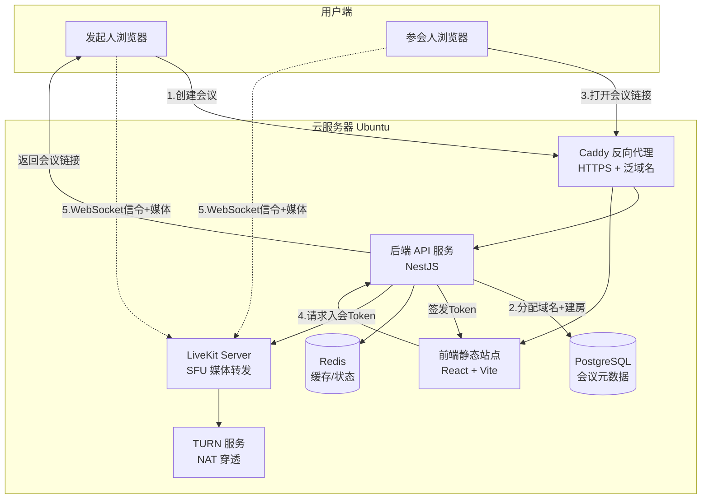
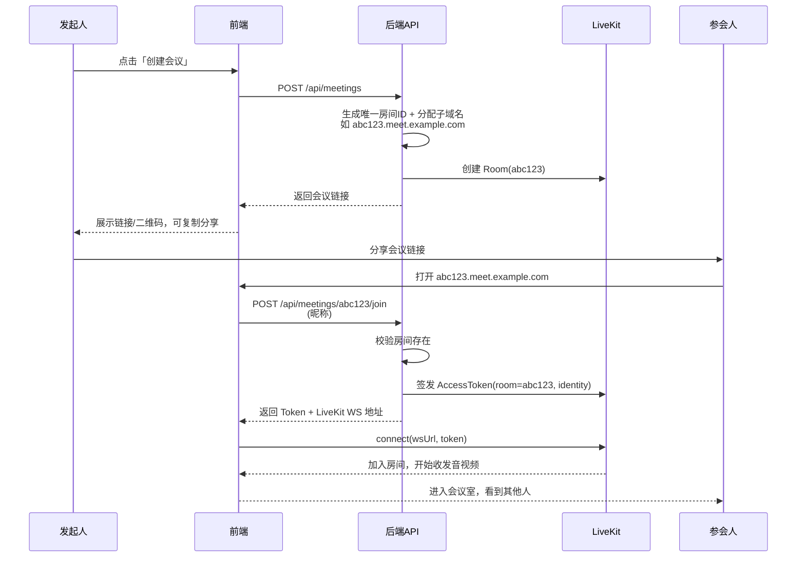
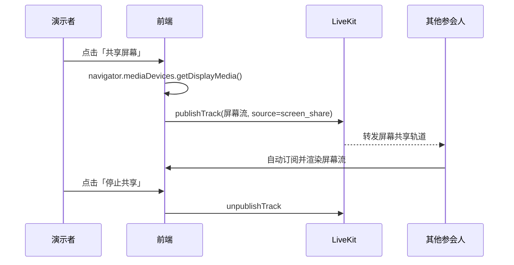
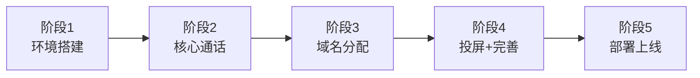

# 会议软件开发方案

> 一句话目标:打开即分配一个域名，拿到域名/链接的人都能登录进来，进行多人音视频通话、投屏演示。

---

## 一、需求确认

| 维度 | 结论 |
|---|---|
| 使用规模 | 大型会议，**16 人以上** |
| 落地方式 | **用现成开源平台最快上线**（不自己从零撸 WebRTC） |
| 部署环境 | **自己的云服务器**（Ubuntu，有公网 IP） |
| 核心功能 | 多人音视频通话、屏幕共享（投屏演示）、拿链接即入会 |
| 登录方式 | 无需注册，**拿到会议域名/链接即可加入** |

---

## 二、技术栈选型

### 2.1 为什么选 LiveKit

16 人以上的会议，**P2P 网状连接会爆**（每人要维护 N-1 条连接，上行带宽被 N 倍放大）。必须用 **SFU（选择性转发单元）** 架构：每人只上传一路流到服务器，服务器按需转发给其他人。

现成的开源 SFU 方案里，**LiveKit** 是当前上线最快、生态最完整的：

- 开源、可完全自托管在你的云服务器上，**无第三方按分钟计费**
- 官方提供前端组件库（React/Vue/移动端），会议室 UI 几乎开箱即用
- **屏幕共享（投屏）是一等公民**，一行 API 搞定
- 自带 Server SDK，签发 Token、管理房间非常简单
- 支持录制、级联扩容，后期长大不用换架构

> 对比：mediasoup 更底层可控但开发周期长；Janus 偏老；Agora/声网是 SaaS 按量付费。综合「最快 + 自托管 + 大型会议」，**LiveKit 是最优解**。

### 2.2 完整技术栈

| 层 | 选型 | 职责 |
|---|---|---|
| 音视频核心 | **LiveKit Server**（Go，Docker 部署） | SFU 转发音视频流、屏幕共享 |
| TURN/STUN | **LiveKit 内置 TURN** + coturn（可选备份） | NAT 穿透，保证不同网络下都能连通 |
| 前端 | **React 18 + Vite + TypeScript** | 会议室页面 |
| 前端组件 | **@livekit/components-react** | 现成的会议室 UI 组件 |
| 后端 | **Node.js + NestJS**（或 Express） | 域名分配、房间管理、Token 签发 |
| 后端 SDK | **livekit-server-sdk** | 创建房间、签发 AccessToken |
| 数据库 | **PostgreSQL** | 会议元数据（房间、域名映射、主持人） |
| 缓存 | **Redis** | Token 缓存、在线状态、房间热数据 |
| 反向代理/HTTPS | **Caddy** | 自动 Let's Encrypt 证书 + 泛域名 |
| 部署 | **Docker Compose** | 一键起全套服务 |

### 2.3 版本建议

- Node.js ≥ 20 LTS
- LiveKit Server 最新稳定版（Docker 镜像 `livekit/livekit-server`）
- PostgreSQL 16、Redis 7
- Caddy 2

---

## 三、系统架构

### 3.1 整体架构图



### 3.2 核心流程：创建 → 分配域名 → 入会



### 3.3 投屏（屏幕共享）流程



---

## 四、域名分配设计（核心特色）

### 4.1 泛域名方案

1. 购买一个主域名，例如 `example.com`。
2. 在 DNS 处配置 **泛解析记录**：`*.meet.example.com` → 云服务器公网 IP。
3. Caddy 配置泛域名自动签发通配符证书（需 DNS 供应商 API 支持 DNS-01 挑战）。
4. 每次创建会议，后端生成一个短随机串作为子域名，如 `k7m2x9.meet.example.com`。

### 4.2 域名 → 房间映射

| 字段 | 说明 |
|---|---|
| subdomain | `k7m2x9`，全局唯一，即会议链接 |
| room_id | LiveKit 房间标识（可与 subdomain 相同） |
| host_identity | 主持人标识 |
| created_at | 创建时间 |
| expires_at | 过期时间（如 24 小时后房间销毁） |
| status | active / ended |

> 用户访问任意 `*.meet.example.com` 时，Caddy 统一转发到同一个前端；前端从 `window.location.hostname` 解析出 subdomain，向后端换取入会 Token。

### 4.3 备选方案（更简单）

如果泛域名证书配置嫌麻烦，第一版可先用 **路径方式**：`meet.example.com/room/k7m2x9`。功能完全一样，只是没有「独立域名」的观感。**建议 MVP 先用路径，稳定后再升级泛域名。**

---

## 五、功能清单

### 5.1 MVP（第一版必做）

- [ ] 创建会议，分配唯一链接
- [ ] 拿链接即入会（输入昵称，无需注册）
- [ ] 多人音视频通话（摄像头 + 麦克风）
- [ ] 屏幕共享 / 投屏演示
- [ ] 静音 / 关闭摄像头 / 挂断
- [ ] 参会人列表、说话高亮
- [ ] 网格布局 + 演示者聚焦布局切换

### 5.2 第二版增强

- [ ] 文字聊天
- [ ] 主持人权限（踢人、全员静音、锁定房间）
- [ ] 会议录制
- [ ] 虚拟背景 / 美颜
- [ ] 举手、表情、投票
- [ ] 移动端适配 / 小程序

---

## 六、项目结构规划

```
meeting-app/
├── docker-compose.yml          # 一键部署全套服务
├── Caddyfile                   # 反代 + HTTPS + 泛域名
├── frontend/                   # React + Vite 前端
│   ├── src/
│   │   ├── pages/
│   │   │   ├── Home.tsx         # 创建会议页
│   │   │   └── Room.tsx         # 会议室页
│   │   ├── components/          # 自定义 UI 组件
│   │   └── api/                 # 调后端接口
│   └── vite.config.ts
├── backend/                    # NestJS 后端
│   ├── src/
│   │   ├── meetings/            # 会议模块：创建/入会/域名分配
│   │   ├── livekit/             # LiveKit Token 签发封装
│   │   └── main.ts
│   └── package.json
└── notes/                      # 文档目录（本方案所在）
```

---

## 七、关键接口设计

| 方法 | 路径 | 说明 |
|---|---|---|
| POST | `/api/meetings` | 创建会议，返回分配的域名/链接 |
| GET | `/api/meetings/:subdomain` | 查询会议是否存在、状态 |
| POST | `/api/meetings/:subdomain/join` | 提交昵称，换取 LiveKit 入会 Token |
| POST | `/api/meetings/:subdomain/end` | 主持人结束会议 |

**创建会议响应示例：**

```json
{
  "subdomain": "k7m2x9",
  "url": "https://k7m2x9.meet.example.com",
  "roomId": "k7m2x9",
  "expiresAt": "2025-01-02T10:00:00Z"
}
```

**入会响应示例：**

```json
{
  "token": "eyJhbGciOiJIUzI1NiIsInR5cCI6...",
  "wsUrl": "wss://rtc.example.com",
  "roomId": "k7m2x9"
}
```

---

## 八、开发路线图（按最快上线排期）



| 阶段 | 内容 | 预估 |
|---|---|---|
| **阶段 1：环境搭建** | 云服务器装 Docker，跑通 LiveKit Server + Redis + PG，Caddy 配 HTTPS | 1 天 |
| **阶段 2：核心通话** | 后端签发 Token；前端用 `@livekit/components-react` 跑通多人音视频 | 2 天 |
| **阶段 3：域名/房间分配** | 创建会议接口、subdomain 生成、入会 Token、拿链接即入会 | 2 天 |
| **阶段 4：投屏 + 会议室完善** | 屏幕共享、静音/关摄像头、布局切换、参会人列表 | 2 天 |
| **阶段 5：部署上线** | Docker Compose 打包、泛域名证书、压测联调 | 1 天 |

> **最快约 1 周可上线一个能用的 MVP。** 用现成 LiveKit 组件库，前 3 天就能看到多人视频通话的效果。

---

## 九、部署要点（Ubuntu 云服务器）

1. **必须开放端口**：
   - `443`（HTTPS/WSS）
   - `7880`（LiveKit HTTP/WS，实际由 Caddy 代理）
   - `7881`（LiveKit TCP 媒体）
   - `50000-60000/udp`（LiveKit 媒体 UDP 端口段，云服务器安全组要放行）
2. **公网 IP**：LiveKit 需要正确配置 `rtc.use_external_ip` 或显式填公网 IP，否则 NAT 后连不通。
3. **HTTPS 是硬要求**：浏览器的 `getUserMedia`/`getDisplayMedia` 只在 HTTPS（或 localhost）下可用，投屏必须走 HTTPS。
4. **.sh 脚本用 LF 换行符**（Unix 换行），部署脚本放项目根目录。

---

## 十、下一步

确认本方案后，建议从**阶段 1** 开始：
1. 我可以先生成 `docker-compose.yml` + `Caddyfile`，把 LiveKit 全套服务在你服务器上跑起来。
2. 再搭前端最小会议室 Demo，先跑通「两人视频通话」验证链路。
3. 然后做域名分配逻辑。

> 需要我直接开始写阶段 1 的部署文件吗？
```
